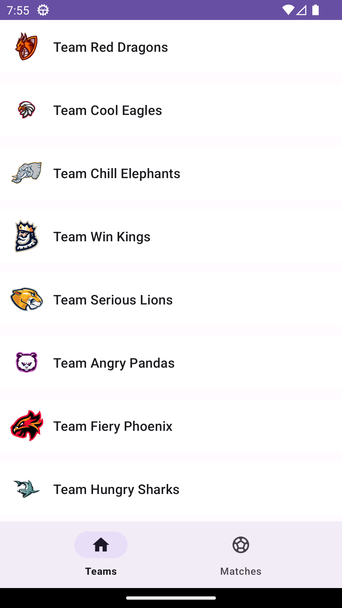
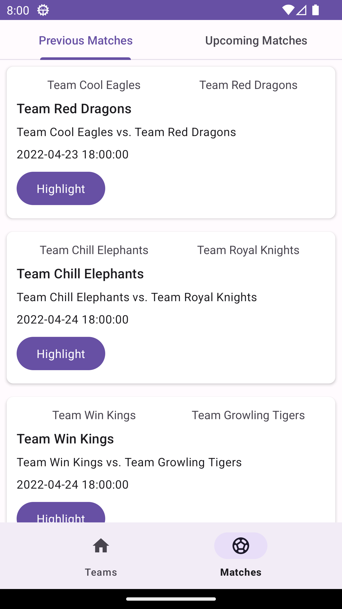
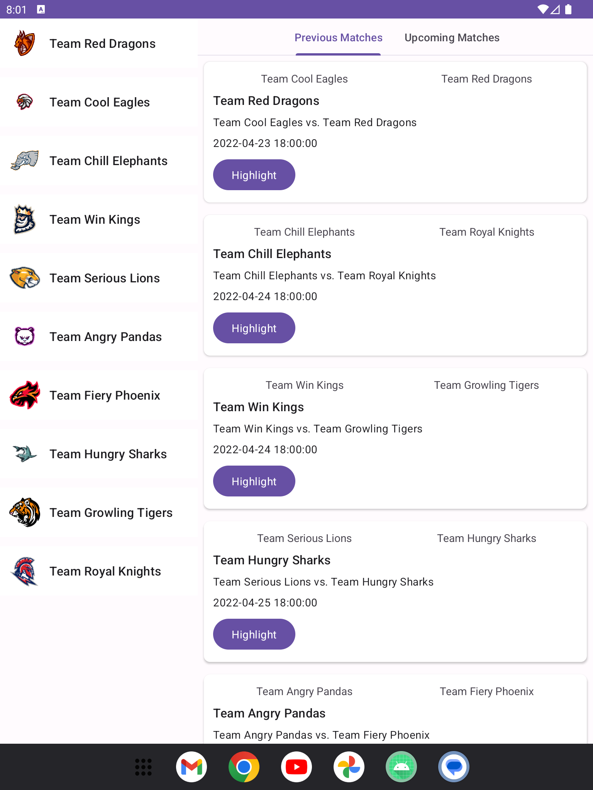
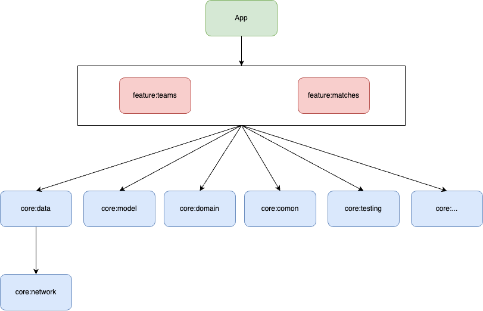

Amazonaws Android App
==================

# Features

### Teams

- Display all teams get from API.

### Matches

- Display previous and upcoming matches.
- User can watch highlights video of previous matches.
- Set schedule for upcoming, for testing notification will be show after 5 seconds.

# Architecture

Follows the [official architecture guidance](https://developer.android.com/topic/architecture)

## Pros

- Independent of component.
- Easy for testing.
- Readable
- With team have many member, easy to share features.
- Single source of truth.
- Reuseable.

## Cons

- Need wire more code.
- Navigation is difficile with android xml.

# Build and dependencies

- Gradle composite build.
- Version catalog.

# Library used

## Develop

- Android core.
- Navigation
- Material design
- Media3

## DI

- koin

## Testing

### Unitest

- mockk
- jnuit
- mockwebsever

### UiTest

- Espresso
- Kaspresso.

# Preformance:

### Recyclerview

- With recyclerview use Recyclerview Prefetch view pool in background.
- Async text loading.